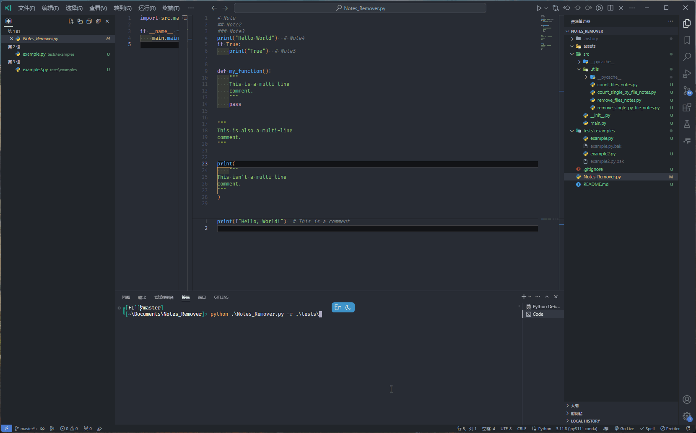

# Notes Remover

统计或删除 Python 文件中的注释，支持单个文件或文件夹。

## Usage

### Count Notes

### 无参数调用，或使用 -c --count_notes 参数调用，执行统计注释功能

Single .py file

```powershell
python .\Notes_Remover.py .\tests\examples\example.py
```

```powershell
python .\Notes_Remover.py -c .\tests\examples\example.py
```

```powershell
python .\Notes_Remover.py --count_notes .\tests\examples\example.py
```

Folder

```powershell
python .\Notes_Remover.py .\tests\examples\
```

运行结果

```cmd

================================================================================
文件名：example.py
注释信息：
--------------------------------------------------------------------------------
行号    注释内容
1       Note
2        Note2
3       # Note3
4       Note4
6       Note5
10      \n    This is a multi-line\n    comment.\n
11      \n    This is a multi-line\n    comment.\n
12      \n    This is a multi-line\n    comment.\n
13      \n    This is a multi-line\n    comment.\n
18      \nThis is also a multi-line\ncomment.\n
19      \nThis is also a multi-line\ncomment.\n
20      \nThis is also a multi-line\ncomment.\n
21      \nThis is also a multi-line\ncomment.\n
--------------------------------------------------------------------------------
注释行数：      13              总行数：        32              注释占比：      41%
注释字母数：    106             总字母数：      276             注释字母占比：  38%
================================================================================
文件名：example2.py
注释信息：
--------------------------------------------------------------------------------
行号    注释内容
1       This is a comment
--------------------------------------------------------------------------------
注释行数：      1               总行数：        2               注释占比：      50%
注释字母数：    17              总字母数：      45              注释字母占比：  38%
================================================================================

```

### Remove Notes

### 使用 -r --remove_notes 参数调用，执行删除注释功能

Single .py file

```powershell
python .\Notes_Remover.py -r .\tests\examples\example2.py
```

```powershell
python .\Notes_Remover.py --remove_notes .\tests\examples\example2.py
```

Folder

```powershell
python .\Notes_Remover.py -r .\tests\examples\
```

```powershell
python .\Notes_Remover.py --remove_notes .\tests\examples\
```

运行结果


